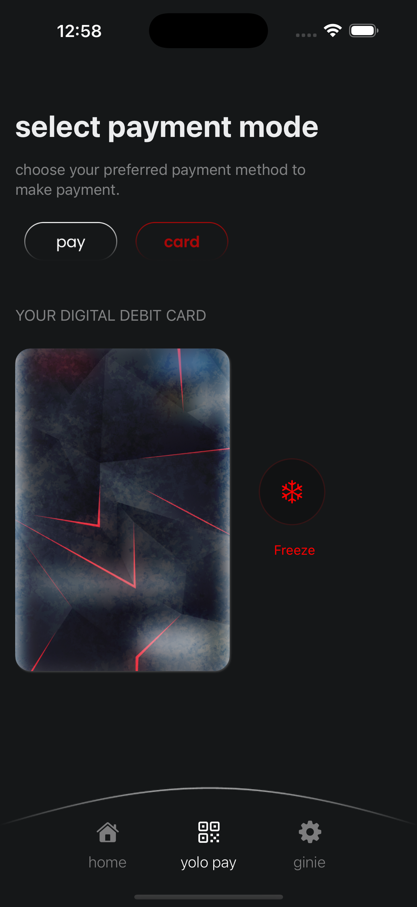

# YOLO TASK 🚀

Welcome to **YOLO TASK**, the repository for YOLO React Native practical demo task. This project demonstrates pixel-perfect design implementation, navigation, and a custom debit card design with animation features.

---

## Screenshots

<div style="display: flex; flex-direction: 'row';">





</div>

## Demo

<div style="display: flex; flex-direction: 'row';">

</div>

---

## Get Started

### 1. Clone the repository

```bash
git clone <repository-url>
```

### 2. Install dependencies

```bash
npm install
```

### 3. Start the app

```bash
npx expo start
```

This command will provide options to run the app in:

- A [development build](https://docs.expo.dev/develop/development-builds/introduction/)
- [Android emulator](https://docs.expo.dev/workflow/android-studio-emulator/)
- [iOS simulator](https://docs.expo.dev/workflow/ios-simulator/)
- [Expo Go](https://expo.dev/go) for testing in a limited sandbox environment

---

## Reset the Project

To start fresh with a blank app directory, run the following command:

```bash
npm run reset-project
```

This will move the existing starter code to the **app-example** directory and create a new blank **app** directory for development.

---

## Learn More

To dive deeper into the project or Expo framework, check out these resources:

- [Expo Documentation](https://docs.expo.dev/): Learn the fundamentals or explore advanced topics with [guides](https://docs.expo.dev/guides).
- [Learn Expo Tutorial](https://docs.expo.dev/tutorial/introduction/): Follow a step-by-step guide to build a project that runs on Android, iOS, and web.

---

## Feedback

We'd love to hear from you! Share your feedback or reviews:

- On [GitHub](https://github.com/hellochirag)
- On [LinkedIn](https://www.linkedin.com/in/chiragjadav/)
- Via email at [chiragjadav134@gmail.com](mailto:chiragjadav134@gmail.com)

---

Let’s build something amazing together! 🚀

